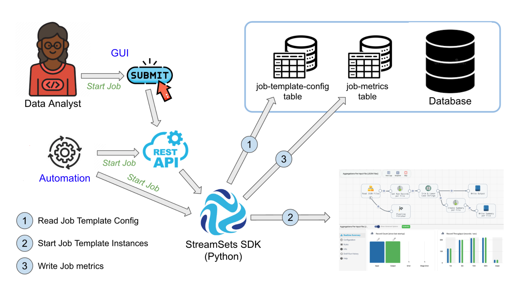

## streamsets-job-template-service
This project provides an example of how to use the [StreamSets Platform SDK](https://docs.streamsets.com/platform-sdk/latest/index.html) to start Job Template instances based on runtime parameters passed in an API request, with additional parameter values retrieved from a configuration database. After Jobs complete, Job metrics are captured and written to the database. 

A REST API service wrapper is provided for integration flexibility.
In this version, Jobs are assumed to be batch Jobs and metrics are gathered after the Jobs complete. One could enhance this project to capture metrics for streaming Jobs as well.

## Overview

Here is an overview of the process:

- There are many scenarios where a StreamSets Job could be launched using this Job Template Service. For example:
  - An Analyst could click a button in a custom UI (not provided here) that makes REST API calls to the Job-Template-Service to launch a Job.

  - A GitHub Action or other CI/CD automation systems could start a Job using REST API calls to the Job-Template-Service. 
  
  - Schedulers like Apache Airflow or other applications with Python bindings could directly call the Python Job Template Runner script.
  
- A subset of the Job's runtime parameters will be passed in by the caller, which we refer to as the "dynamic" runtime parameters, with additional pipeline and connection parameters retrieved from a configuration store, which we refer to as "static" runtime parameters.


- The configuration store used in this example is a Postgres database.

- The service will dynamically select the Job Template to be launched based on rules applied to the request's <code>source-type</code> and  <code>target-type</code> values.

- The service creates and starts Job Template Instance(s) that StreamSets Control Hub schedules on engines.

- The service spawns a new thread for each Job Template Instance, and each thread waits until its instance completes, then gathers the instance metrics and inserts the metrics into a database table.



## Prerequisites

- A PostgreSQL database

- Python 3.8+

- [Psycopg](https://pypi.org/project/psycopg2/) - PostgreSQL database adapter for Python

- [Flask](https://pypi.org/project/Flask/) - Python web application framework 

- StreamSets Platform SDK for Python v6.0.1+

- StreamSets Platform [API Credentials](https://docs.streamsets.com/portal/platform-controlhub/controlhub/UserGuide/OrganizationSecurity/APICredentials_title.html#concept_vpm_p32_qqb) for a user with permissions to start Jobs 
## Implementation Details


- The REST API is implemented using Flask in the file [job_template_service.py](python/job_template_service.py)

- Assume we want to create and run an instance of a Job Template named <code>REST API to Google Cloud Storage</code> that expects this set of runtime parameters:

	
	
	
  In this case, we expect the user to pass in values for the <code>HTTP_URL</code>, <code>CITY</code>, <code>GCS_BUCKET</code>, and <code>GCS_FOLDER</code> parameters; with the static parameters <code>HTTP_METHOD</code>, <code>HTTP_MODE</code>, and <code>GCS_CONNECTION</code> retrieved from the configuration database.
  
  
	
  

- The Job Template Service API would be called with a POST request to the endpoint <code>/streamsets/job-template-runner</code> with a JSON payload that passes in the following args:

		user-id
		user-run-id
        source-type
        target-type
        runtime-parameters
        
    An example call might look like this:
```
     $ curl -X POST \
          "http://sequoia.onefoursix.com:8888/streamsets/job-template-runner" \
          -H "content-type: application/json" \
          -d '{
            "user-id": "mark@onefoursix.com",
            "user-run-id": "run-123",
            "source-type": "http",
            "target-type": "gcs",
            "runtime-parameters": [
              {
                "HTTP_URL": "http://api.openweathermap.org/data/2.5/weather",
                "CITY": "London",
                "GCS_BUCKET": "146_gcs_bucket",
                "GCS_FOLDER": "UK"
              }
            ]
          }'
```

- One can use any arbitrary string value for the <code>user-run-id</code>, which can be used subsequently to identify the Job metrics associated with the run.


- The Job Template to be run is selected dynamically, based on the <code>source-type</code> and <code>target-type</code>, by the Job Template Runner script.  In this example, the template is selected by looking up the source and target types in the <code>ingestion_pattern</code> table and then selecting the matching Job Template.  See the  <code>get_job_template</code> method in the [database_manager.py](python/database_manager.py) file for details.


- The REST API endpoint calls the  <code>run_job_template</code> method in the file [job_template_runner.py](python/job_template_runner.py)

- All interaction with the StreamSets Platform is managed by the class <code>StreamSetsManager</code> in the file [streamsets_manager.py](python/streamsets_manager.py)


- All interaction with the database is managed by the class <code>DatabaseManager</code> in the file [database_manager.py](python/database_manager.py)


# Configuration Details

- Clone this project to your local machine
<BR/>

- Create the PostgreSQL user, schema, and tables by executing the <code>sql/postgres-tables.sql</code> script against your PostgresSQL database. That will create these four tables in a <code>streamsets</code> schema:
  - <code>job_template</code>
  - <code>ingestion_pattern</code>
  - <code>ingestion_pattern_job_template_relationship</code>
  - <code>job_instance</code>

- Create a file named <code>database.ini</code> at the root of your local project directory with the following entries, with postgres connection properties, including the user and password just created:
```
[postgresql]
host=localhost
port=5432
database=postgres
user=streamsets
password=streamsets
```
<BR/>

- Create a file named <code>streamsets.ini</code> at the root of your local project directory with the following entries:
```
[streamsets]
cred_id=<YOUR CRED ID>
cred_token=<YOUR CRED TOKEN>
```

<BR/>


- Create or select an existing parameterized pipeline and Job Template in Control Hub. For example, I'll use a Job Template named <code>REST API to Google Cloud Storage</code>

<BR/>

- Insert a record into the <code>ingestion_pattern</code> table to map a source and target types to a pattern name. For example, the entry for my <code>REST API to Google Cloud Storage</code> Job Template looks like this:


```
insert into streamsets.ingestion_pattern (
  pattern_name,
  source,
  destination,
  create_timestamp
)
 values('http-to-gcs', 'http','gcs', CURRENT_TIMESTAMP);
 ```
 


</BR>

- Insert a record into the <code>job_template</code> table that includes the StreamSets Job Template ID, as well as any static parameters and connections for the source and destination.  For example, for the <code>REST API to Google Cloud Storage</code> Job Template I will insert this record:

```
insert into streamsets.job_template(
  sch_job_template_id,
  delete_after_completion,
  source_runtime_parameters,
  destination_runtime_parameters,
  source_connection_info,
  destination_connection_info,
  create_timestamp
  ) values (
    'c09f728a-2a73-4c7e-b735-2512039a9e6b:8030c2e9-1a39-11ec-a5fe-97c8d4369386',
    false,
    '{"HTTP_MODE": "POLLING", "HTTP_METHOD": "GET"}',
    '{}',
    '{}',
    '{"GCS_CONNECTION" : "9c960db9-7904-47c4-bbc8-4c95dcf9c959:8030c2e9-1a39-11ec-a5fe-97c8d4369386"}',
    CURRENT_TIMESTAMP
);
```

<BR/>

- Insert a record into the <code>ingestion_pattern_job_template_relationship</code> table to join the pattern to the template, like this:

```
insert into streamsets.ingestion_pattern_job_template_relationship (
  ingestion_pattern_id,
  job_template_id,
  schedule
) select p.ingestion_pattern_id, t.job_template_id, '{}'
    from  streamsets.ingestion_pattern p,
          streamsets.job_template t
     where p.source =  'http'
     and p.destination = 'gcs'
     and t.sch_job_template_id = 'c09f728a-2a73-4c7e-b735-2512039a9e6b:8030c2e9-1a39-11ec-a5fe-97c8d4369386';
```

<BR/>

- Edit the value set in this line in the file <code>python/job_template_service.py</code> to specify where the application's log will be written to.  All modules share this log so, for example, if there are permissions issues writing to the database tables, error messages should appear in this log:

    <code>log_file = '/tmp/streamsets-job-template-service.log'</code>

<BR/>

- Edit the value set in this line in the file <code>python/streamsets_manager.py</code> as this value sets the maximum time the app will wait for a Job to complete before getting its metrics.  Jobs that take longer to complete will be considered as having failed.

	<code>max_wait_time_for_job_seconds = 4 * 60 * 60  # four hours</code>
	
<BR/>
	
- The Service's port number is currently hardcoded to port <code>8888</code> in the file <code>job_template_service.py</code>; feel free to change that.	
	
## Start the service
To easily test the service, change to the project's <code>python</code> directory, and start the service in the foreground in its own terminal session using a command like this:

    $ python job_template_service.py


You should see brief output like this:


Tail the app's log to see messages, like this:


<BR/>
<BR/>


## Call the Service using the REST API

In a new terminal session, call the service like this, referencing a <code>user-id</code>, <code>user-run-id</code>, <code>source-type</code>, <code>target-type</code> and any needed runtime parameters.  For example, I'll launch two instances of the <code>REST API to Google Cloud Storage</code> Job Template by including two sets of runtime parameters, like this:

```
    $ curl -X POST \
	  "http://sequoia.onefoursix.com:8888/streamsets/job-template-runner" \
	  -H "content-type: application/json" \
	  -d '{
            "user-id": "mark@onefoursix.com",
            "user-run-id": "run-123",
            "source-type": "http",
            "target-type": "gcs",
            "runtime-parameters": [
              {
                "HTTP_URL": "http://api.openweathermap.org/data/2.5/weather",
                "CITY": "London",
                "GCS_BUCKET": "146_gcs_bucket",
                "GCS_FOLDER": "UK"
              },
              {
                "HTTP_URL": "http://api.openweathermap.org/data/2.5/weather",
                "CITY": "Phoenix",
                "GCS_BUCKET": "146_gcs_bucket",
                "GCS_FOLDER": "US"
              }
            ]
          }'

```


If all goes well, the service should return an <code>OK</code> status:


<BR/>
<BR/>
	
## Confirm the Job Template Instances are Running

You should see two Job Template Instances are running:


Look at each instance's details page in Control Hub to confirm the full set of runtime parameters used, including both the static and dynamic values. For example:


Once the instances complete, you should see their metrics in the <code>streamsets.job_run_metrics</code> table.  I'll force quit one of the Job instances to confirm the service distinguishes between instances that terminate normally and those that do not:


<code>SQL> select * from streamsets.job_run_metrics;</code>


Note the <code>user_id</code> and <code>user_run_id</code> fields added to the <code>job_run_metrics</code> table which allows the user to correlate their request with the subsequently written metrics.


